<!-- Generated by GitHub Profile Agent Console. Edit profile.config.json, then run npm run generate. -->

  <picture>
    <source media="(max-width: 760px) and (prefers-color-scheme: dark)" srcset="./assets/hero/agent-console-bc3a70d4-mobile-dark.svg">
    <source media="(max-width: 760px)" srcset="./assets/hero/agent-console-bc3a70d4-mobile-light.svg">
    <source media="(prefers-color-scheme: dark)" srcset="./assets/hero/agent-console-bc3a70d4-dark.svg">
    <source media="(prefers-color-scheme: light)" srcset="./assets/hero/agent-console-bc3a70d4-light.svg">
    
  </picture>

  

## About Me

I build practical systems at the intersection of artifical intelligence

My work combines technical exploration with a builder mindset: understand the problem, test the system, and share what actually works.

## Current Focus

| Area | What I am exploring |
| --- | --- |
| **AI Agents** | Autonomous workflows |

## Featured Work

| Project | Focus | Why it matters |
| --- | --- | --- |
| [**SPPG**](https://github.com/mizanialriyzqi/SPPG) | AI Nutrition Management | AI-assisted nutrition management for menus, stock, recipients, distribution, and reports. |

## Research Direction

I am interested in systems that can observe state

## Tech Stack

`Typescript` · `Vue` · `PostgreSQL`

## Recent Activity

<!-- AUTO:ACTIVITY:START -->
_Recent public activity will appear here after the workflow runs._
<!-- AUTO:ACTIVITY:END -->

---

  Building thoughtful systems and sharing what works

